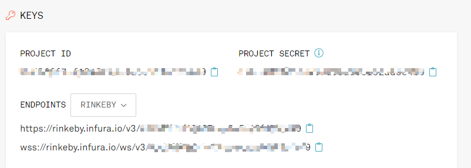

# `Uniswap-V2`

参考链接
https://monokh.com/posts/uniswap-from-scratch

去中心化交易所

- AMM协议：AutoMated Market Making 
  - AutoMate(d)： ⾃动，没有中间机构进⾏资⾦交易
  - Market Making: 做市商（保证订单得以执⾏），流动性提供者（LP: liquidity providers） 
    - 流动性指的是如何快速和⽆缝地购买或出售⼀项资产
    - LP 是提供资产的⼈以实现快速交易。
- 常量乘积模型： K = x * y
  - AMM 的执⾏引擎， 没有价格预⾔机，价格⽤公式推导
  -  x：token0 的储备量（reserve0） 
  - y：token1 的储备量（reserve1） 
- 提供流动性：
  - 转⼊token0、token1，增加reserve0、reserve1，拿到流动性凭证 = sqrt(x * y)
- 兑换时，K 保持不变
  - 减少reserve0，就必须增加reserve1 
  - 减少reserve1，就必须增加reserve0 
- 移除流动性
  - 通过流动性凭证，撤出token0、token1

价格滑点（slippage）：⼀次交易使价格改变的程度， 单笔交易量越⼤对价格的影响越⼤

### 交易公式


## 无常损失

流动性提供者⽆常损失：⼀对代币存⼊Uniswap后，如果⼀种代币以另⼀种进⾏计价的价格上升，在价格上升后取出，总价格⽐原价值低⼀些，

低的部分就是损失。

https://zhuanlan.zhihu.com/p/268435169


## 知识点：
// 获取 UniswapV2Pair 合约的字节码
```bash
bytes memory bytecode = type(UniswapV2Pair).creationCode;
```

// 使用参数 token0, token1 计算 salt (abi编码)
```bash
bytes32 salt = keccak256(abi.encodePacked(token0, token1));
```

## 创建api key

infura的使用

注册： 
https://infura.io/register

然后登录创建账户，获取project id 



其他`alchemy`创建key

https://docs.alchemy.com/alchemy/introduction/getting-started


## 部署

编译时出现该错误
```bash
TypeError: Explicit type conversion not allowed from "int_const -1" to "uint128".
  --> @uniswap/lib/contracts/libraries/BitMath.sol:48:17:
   |
48 |         if (x & uint128(-1) > 0) {
   |                 ^^^^^^^^^^^

```
解决方法，注销调用编译版本过高的配置
```bash
{
        version: "0.8.4",
        settings: {
          "optimizer": {
            "enabled": true,
            "runs": 200
          }
        }
      },
```

修改`UniswapV2Library`里`pariFor()`方法里计算交易对合约地址的`init_code`（也就是最后一个参数32字节的hash值）过去方式见下面的 ** create2 方式部署合约 **


## create2 方式部署合约 
`create2` 使用场景: https://learnblockchain.cn/article/1297

计算合约地址时`init_code` 获取方式：
### 获取bytecode
1. 使用VSCode编译插件编译获取对应合约的.bin文件，里面的内容就是bytecode
2. 使用remix编译合约，点击左边编译按钮，点击右下角bytecode复制内容，取出里面`object`对应的值

### 获取init_code
将上面获取的byteCode粘贴到http://emn178.github.io/online-tools/keccak_256.html
选择inputType为Hex得到hash值 就是计算合约地址的`init_code`

在UniswapV2Factory.sol中新增如下代码，用于获取 `type(UniswapV2Pair).creationCode`的 `keccak256`值
```solidity
bytes32 public constant INIT_CODE_PAIR_HASH = keccak256(abi.encodePacked(type(UniswapV2Pair).creationCode));`
```
将值粘贴到 keccak_256 后获取hash值(注意要用hex模式)，
替换 UniswapV2Router02.sol 中的 initCode 码（之所这么做是因为Router需要通过这个hash找到Pair的地址，而hash会随着编译环境的改变而变化，真他妈是个鬼才！）
